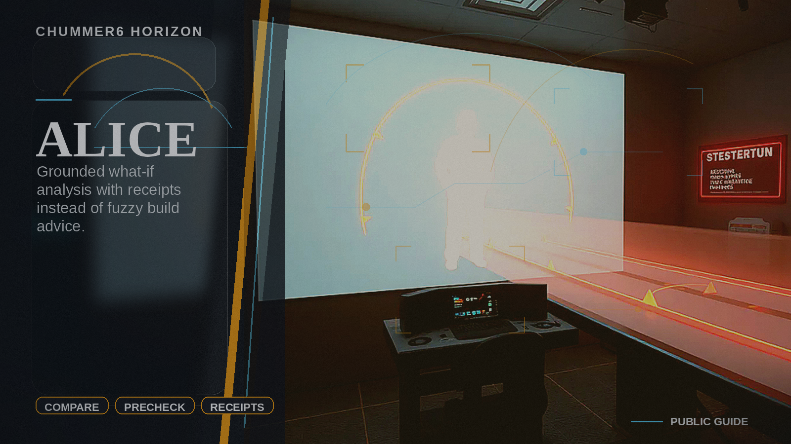

# ALICE

Builders get grounded what-if analysis without trusting black-box suggestions.

## Why this matters

We only discover weak builds after they explode in public.

Picture the scene: A player compares two builds and sees grounded tradeoffs with the math and the source trail still visible.

## Current stage

- Today: Future concept.
- Next: Research and prototypes.

## The problem

Players often discover bad builds, illegal interactions, or weak upgrade paths only after the run has already gone sideways.

## What it would do

Chummer would compare builds, catch trouble before play, and explain tradeoffs without making up rules or legality.

## What has to be true first

* explain views that show their work
* deterministic runtime data
* strong comparison flows

## Why it is not ready yet

The product still needs reliable comparison and explanation surfaces before it should hand out higher-level build advice.
