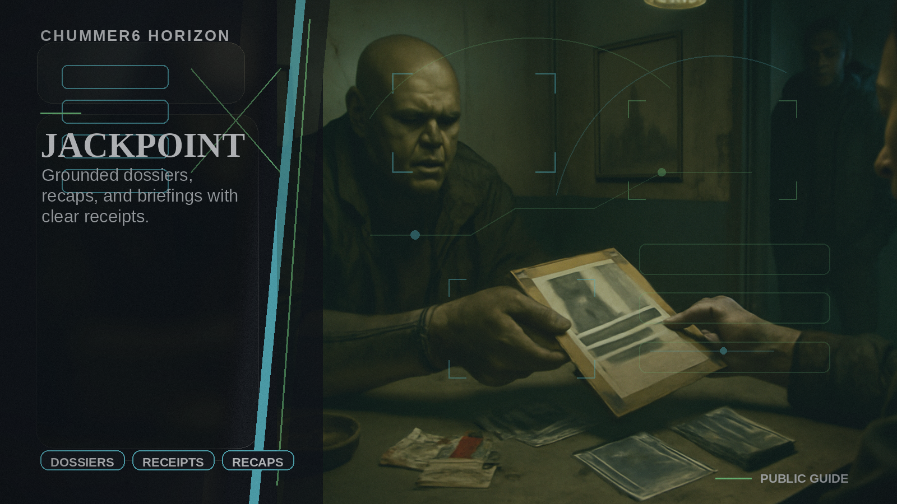

# JACKPOINT

The table gets polished short-to-medium-form dossiers, recaps, and briefings that still show their source trail.

## Why this matters

I want dossiers, recaps, and briefings that feel good without making things up.

Picture the scene: After a run, the GM exports a dossier-plus-recap packet with narration, evidence rooms, and share-safe previews.

## Current stage

- Today: Future concept.
- Next: Research and prototypes.

## The problem

Players and GMs want dossiers, recaps, primers, and narrated briefings, but most content tools either invent details or strip away where the facts came from.

## What it would do

JACKPOINT would turn approved session material into dossiers, recaps, narrated briefings, evidence rooms, share cards, and creator packs.
It is the short-to-medium-form publishing studio, not a replacement for full books.

## What has to be true first

* a fact trail that survives formatting
* approval states
* registry and media working together cleanly
* source classification
* reliable publication workflows

## Why it is not ready yet

These outputs only matter if the source trail survives writing, narration, preview generation, and publication.
Until that chain is reliable, Chummer should not sell the studio as ready.
