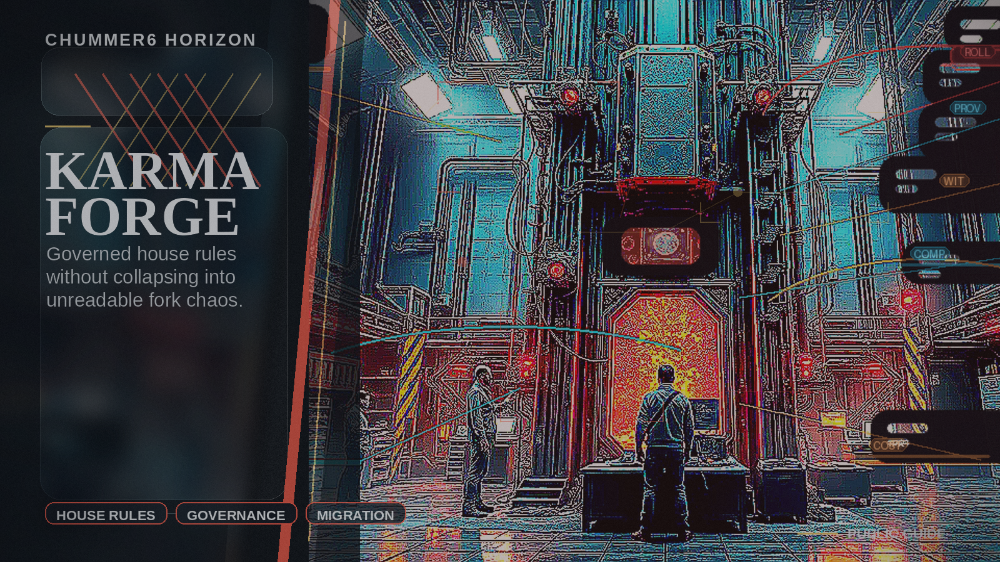

# KARMA FORGE

Tables can evolve house rules without splintering into unreadable forks.

## Why this matters

I want house rules without fork chaos.

Picture the scene: A GM promotes a house-rule pack with visible impact, approval history, and reversible publication state.

## Current stage

- Today: Future concept.
- Next: Research and prototypes.

## The problem

Groups want house rules and alternate rule environments without forking themselves into incompatible chaos.

## What it would do

Chummer would let groups publish, review, and reuse house-rule sets with visible impact and compatibility checks, without turning them into private forks.

## What has to be true first

* ruleset ABI discipline
* clear package ownership
* registry compatibility metadata
* approval and publication flows

## Why it is not ready yet

Rule changes can fracture tables quickly if compatibility and rollback are not already dependable.
