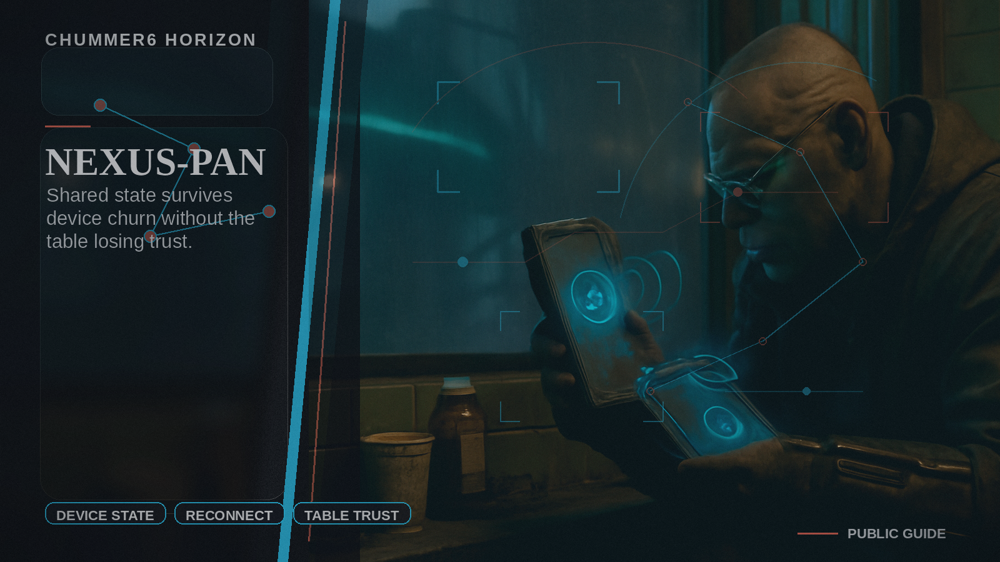

# NEXUS-PAN

Shared state survives device churn without the table losing trust.

## Why this matters

My devices drift and the table loses confidence.

Picture the scene: A player reconnects mid-session and catches up without the GM reconstructing state by memory.

## Current stage

- Today: Future concept.
- Next: Research and prototypes.

## The problem

When phones, tablets, or laptops drift apart during play, the whole table stops trusting what is on screen.

## What it would do

Chummer would keep reconnects and shared session state steady enough that players can jump back in without the GM rebuilding context by hand.
It would extend the core rules and session record instead of inventing a second source of truth.
It also covers premium degraded-mode behavior: clear offline posture, safe local continuity, and honest conflict recovery when the network or device handoff goes bad.

## What has to be true first

* durable session state
* reliable sync bundles
* visible reconnect explanations
* in-session reliability
* offline-capable local state
* explicit stale, pending, and conflicted state

## Why it is not ready yet

The live release still needs boringly reliable session continuity.
Until reconnects and shared-state handoffs stay solid under stress, a richer PAN layer would add confusion instead of removing it.
