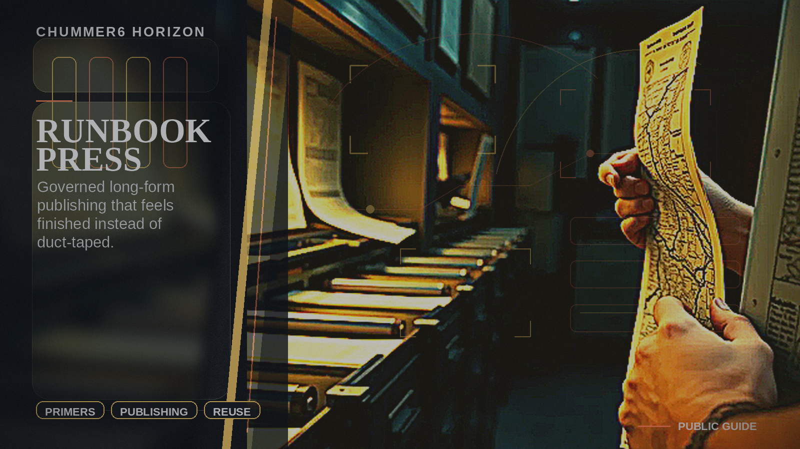

# RUNBOOK PRESS

Long-form publishing becomes governed, reusable, and materially better than one-off document hacks.

## Why this matters

I want real primers, handbooks, and campaign books without duct-taping ten tools together.

Picture the scene: A creator turns approved Chummer source material into a district guide or campaign book without making vendor dashboards the source of truth.

## Current stage

- Today: Future concept.
- Next: Research and prototypes.

## The problem

GMs, creators, and publishers need consistent long-form books such as primers, campaign books, district guides, and convention modules, but current workflows are slow and hard to standardize.

## What it would do

Chummer would help teams turn approved source material into primers, handbooks, district guides, campaign books, and convention modules without making third-party dashboards the source of truth.
It complements JACKPOINT instead of duplicating it.

## What has to be true first

* approved source packs
* publication manifests
* format and render adapters
* editorial approval flows

## Why it is not ready yet

Long-form output only matters if the approved source, edit trail, and publication package stay intact from draft to release.
