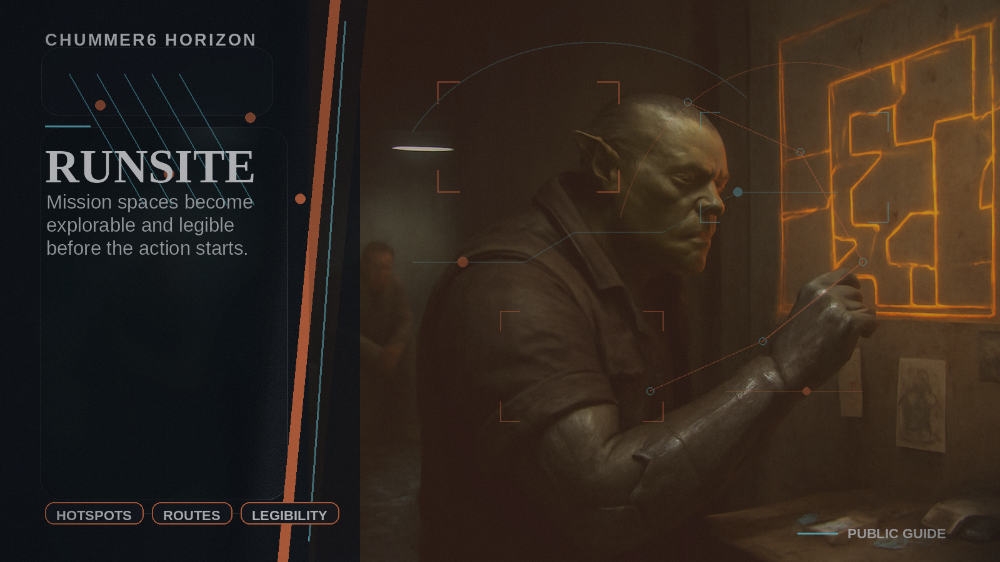

# RUNSITE

Mission spaces become explorable and legible before the action starts.

## Why this matters

My players still misread the space even after the briefing.

Picture the scene: A GM sends an explorable safehouse pack with hotspots, floor plans, route overlays, and optional narration before the session.

## Current stage

- Today: Future concept.
- Next: Research and prototypes.

## The problem

GMs spend too long describing spaces, and players still misread compounds, clubs, hotels, museums, arcologies, and safehouses once the action starts.

## What it would do

Chummer would publish explorable location packs linked to mission briefings.
They could include floor plans, hotspots, route overlays, optional narration, and static map context, but they stay focused on pre-run orientation rather than live combat truth or VTT replacement.
RUNSITE is for briefing, planning, and spatial understanding before things go loud.

## What has to be true first

* clean media manifests
* permissioned publication links
* preview and embed receipts
* reliable map and render adapters

## Why it is not ready yet

The new vendor path makes this more plausible, but Chummer still needs a reliable permission model and a clear source trail before it should present RUNSITE as a real feature.
