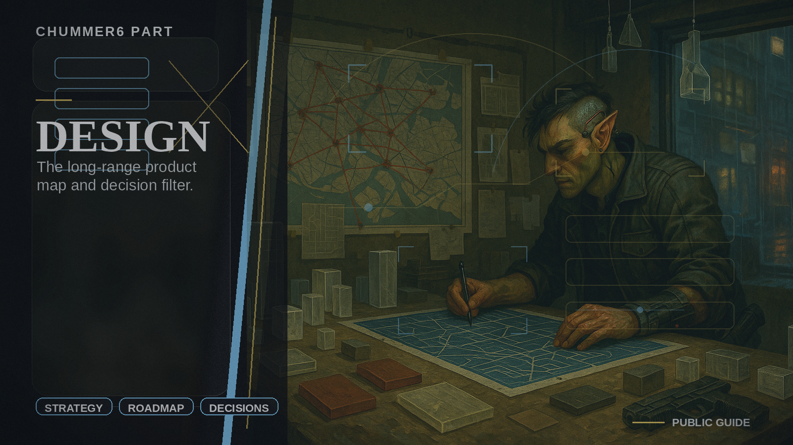

# Design

The long-range product map and decision filter.

## When you care

You want to understand why a feature exists, what is real today, or where to go deeper after the friendly tour.

## Why you care

It keeps the public story, the landing page, the guide, and the future ideas tied to one shared plan instead of a pile of clever guesses.

## What you notice

- clearer labels about what is real now, what is preview, and what is still future-facing
- a stable product story before you dive into implementation detail
- one place that keeps the public-facing surfaces aligned

## Current limits

- you should not need this first for normal use
- it is the map, not the running software

## Current state

Design already owns the public landing story, guide policy, horizons, participation language, and the line between public story and deeper source material.

## Go deeper

- ../NOW/current-status.md
- ../WHERE_TO_GO_DEEPER.md
