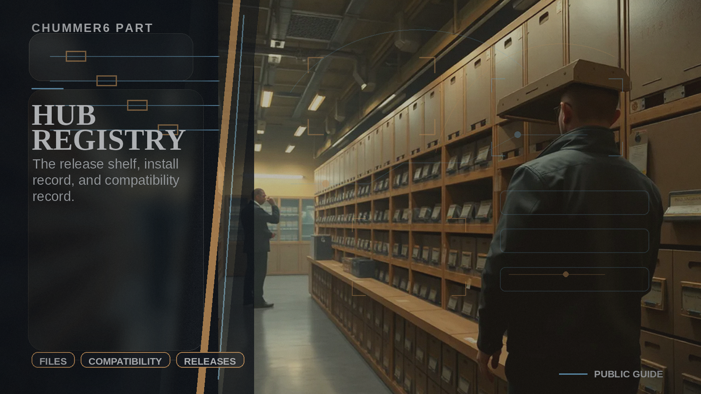

# Hub Registry

The release shelf, install record, and compatibility record.

## When you care

You care about what exists, what can be installed, what is published, or whether a release file can be trusted and reused.

## Why you care

Without this, release files turn into a warehouse full of unlabeled boxes and compatibility folklore.

## What you notice

- cleaner release metadata and publication status
- a more believable path from preview outputs to shareable or installable files
- compatibility and moderation signals that can stay on the record

## Current limits

- this is not the media studio
- this is not the rules engine

## Current state

Hub Registry is the growing record for published releases and compatibility, and it becomes more visible as the public release story gets richer.

## Go deeper

- ../NOW/public-surfaces.md
- ../WHERE_TO_GO_DEEPER.md
