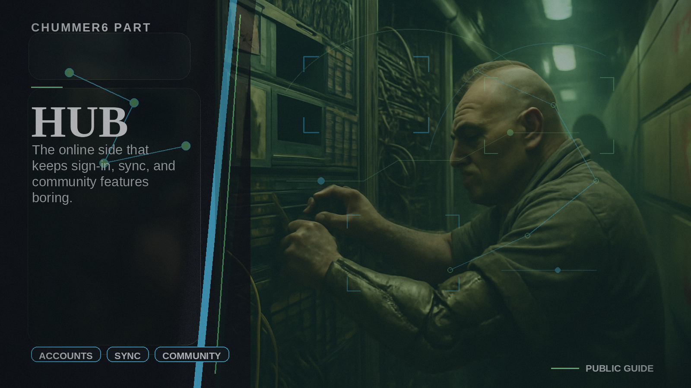

# Hub

The online side that keeps sign-in, coordination, and community features boring.

## When you care

You sign in, sync across devices, follow what is coming next, or use participation and recognition features.

## Why you care

It keeps accounts, shared coordination, and community features from turning into manual glue work.

## What you notice

- sign-in and account pages
- public landing, home, and participation entry points
- shared coordination, release status, and recognition views that make sense without a backend tour

## Current limits

- it is not where the rules math becomes true
- some deeper admin and support work still sits behind the customer-facing layer

## Current state

Hub already powers identity, landing and home views, participation, and community features, but it is still simplifying the handoff between customer-facing coordination and deeper admin work.

## Go deeper

- ../NOW/current-status.md
- ../WHERE_TO_GO_DEEPER.md
