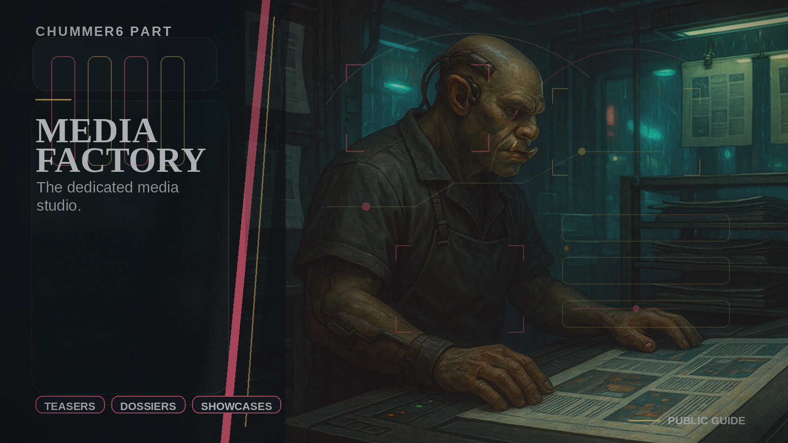

# Media Factory

The dedicated media studio.

## When you care

You care about finished images, teaser media, dossiers, narrated packets, or other polished outputs that still need a clear source trail.

## Why you care

This is how the product can look finished without letting style quietly rewrite the facts.

## What you notice

- cleaner asset generation and preview flows
- a stronger line between content rendering and product meaning
- a path toward richer teaser and release media without forcing every product area to become its own studio

## Current limits

- this is not the decision-maker for what a session means
- it should stay focused on media production even when the outputs get more ambitious

## Current state

Media Factory is where polished media gets produced and curated, and the current work is about making richer outputs possible without blurring where the material came from or who owns it.

## Go deeper

- ../NOW/public-surfaces.md
- ../WHERE_TO_GO_DEEPER.md
