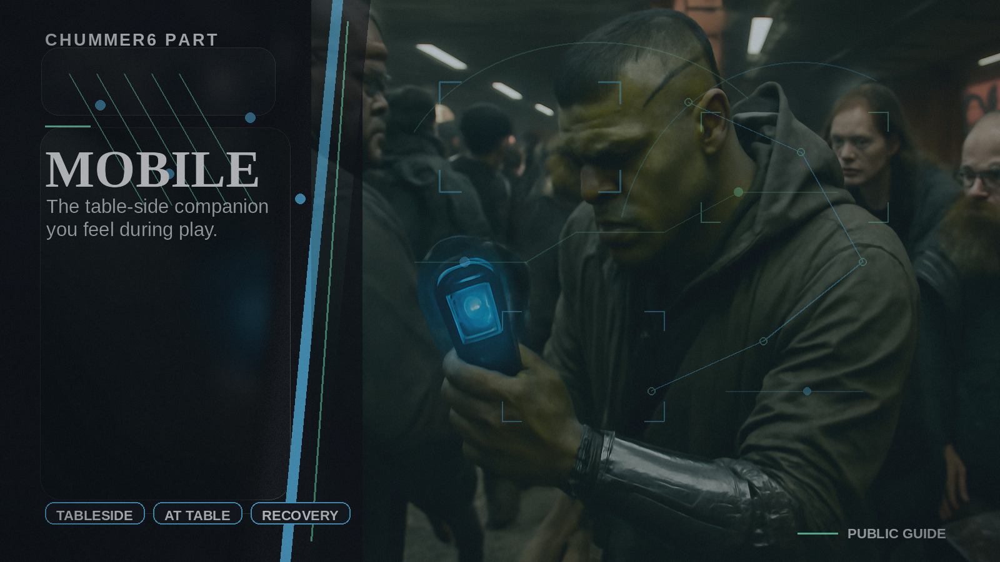

# Mobile

The table-side companion you feel during play.

## When you care

You care about actual play, reconnecting across devices, or surviving a bad signal without losing the session.

## Why you care

This is the jump from prep software to software that can stay useful while a real session is happening.

## What you notice

- stronger local-first and offline-ready behavior
- session continuity instead of fragile single-device assumptions
- a table-facing companion that is separate from the heavy workbench view

## Current limits

- this is still the next major boundary to finish cleanly
- the session stack is still deepening around cache, replay, and recovery polish

## Current state

Mobile is where the live-session promise becomes real, and the current work is about event logs, cache, replay, and sync rather than cosmetic flash.

## Go deeper

- ../NOW/public-surfaces.md
- ../WHERE_TO_GO_DEEPER.md
