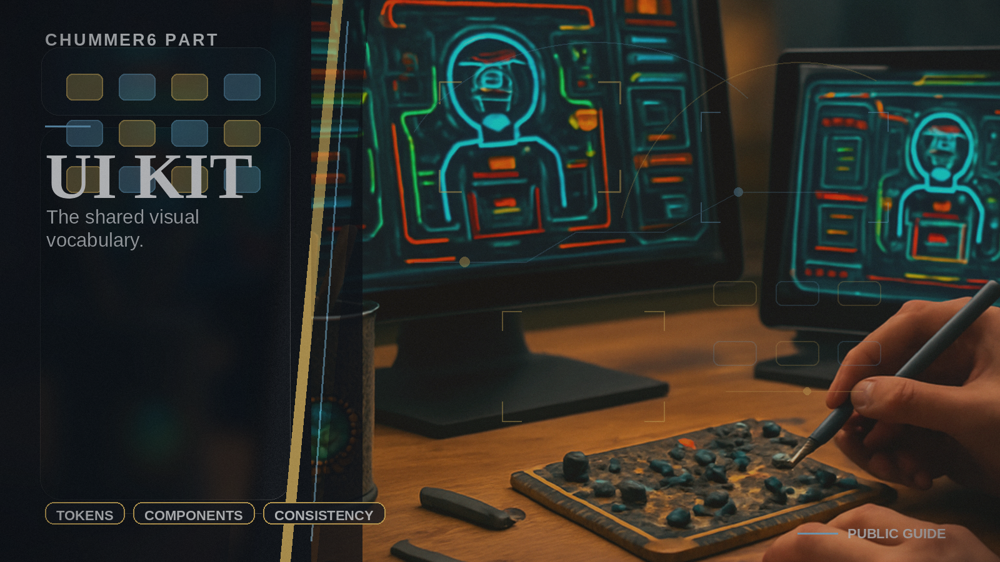

# UI Kit

The shared visual vocabulary.

## When you care

You notice the product feeling more coherent instead of looking like unrelated tools wearing matching coats by accident.

## Why you care

Shared visual primitives keep the split from feeling like several products pretending to be one.

## What you notice

- more consistent chrome, badges, banners, and dense-data presentation
- fewer one-off UI reinventions in each surface
- stronger accessibility and a reusable component system

## Current limits

- it is a shared package layer, not a standalone product
- it only counts when the other heads visibly get smaller because it exists

## Current state

UI Kit is real enough to matter, and the next proof point is whether the rest of the product can consume it instead of rebuilding visual boundaries one page at a time.

## Go deeper

- ../NOW/current-status.md
- ../WHERE_TO_GO_DEEPER.md
