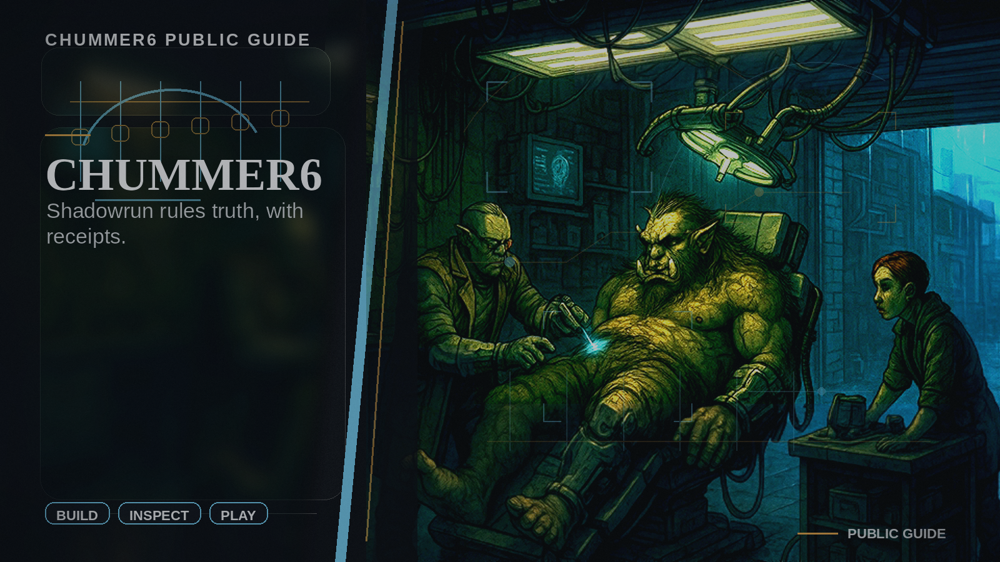

# Chummer Public Guide

Start here if you want the public answer first: what Chummer6 does, what is real today, and whether the current preview is worth your time.

## Product promise

Shadowrun rules truth, with receipts.

Build characters, inspect rulings, and keep sessions moving with explainable math, durable state, and clear proof of what works today.

- Public preview, honest status, and clear proof of what works today.

## What people usually want to know

- I want to try the preview: [Download](DOWNLOAD.md).
- I want the honest current picture: [Status](STATUS.md).
- I am coming from Chummer5a: [From Chummer5a to Chummer6](FROM_CHUMMER5A_TO_CHUMMER6.md).
- I want the two-minute product story: [What Chummer6 Is](WHAT_CHUMMER6_IS.md).
- I need support or want to report pain: [Help](HELP.md) and [Contact](CONTACT.md).
- I only care about future ideas: [Horizons](HORIZONS/README.md).

## Desktop truth

- Primary desktop route: `Chummer.Avalonia`.
- Fallback desktop route: `Chummer.Blazor.Desktop` only where the shelf and status pages label it as fallback or compatibility.
- Current platform posture: Linux installer proof is the strongest currently published desktop lane.
- What gold still requires: Gold still requires veteran-approved parity, dense-workbench comfort proof, and promoted desktop proof for every promised platform.

## What is real now

- Current stage: Public preview.
- Published downloads are currently visible for Windows and Linux.
- Help, privacy, terms, contact, and release guidance are live as first-party product pages.
- More campaign depth, broader platform coverage, and stronger proof trails are still opening next.

## First contact

## Start here

- [Start here](START_HERE.md)
- [Status](STATUS.md)
- [What Chummer6 Is](WHAT_CHUMMER6_IS.md)
- [How can I help](HOW_CAN_I_HELP.md)
- [Download](DOWNLOAD.md)
- [From Chummer5a to Chummer6](FROM_CHUMMER5A_TO_CHUMMER6.md)
- [Help](HELP.md)
- [FAQ](FAQ.md)
- [Contact](CONTACT.md)
- [Roadmap and future ideas](HORIZONS/README.md)

## Why people keep watching

- Deterministic engine: the same inputs are supposed to produce the same answer, not a vibe-based approximation.
- Rules receipts: the modifier trail is meant to stay attached to the result instead of disappearing behind a black box.
- Local-first continuity: the product is being shaped to survive device drift and bad connectivity without losing the thread.

## Product parts

You do not need this map first. Use it when you want the behind-the-scenes split after the friendly tour.

- [Parts index](PARTS/README.md): the behind-the-scenes product map once you already care how the experience is split.
- [Horizons index](HORIZONS/README.md): future bets and research lanes, clearly separated from what is ready today.

## Need help

Use the first-party product path first: download help, account recovery, current release truth, and a real support intake before you fall through to deeper technical material.
